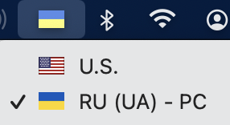
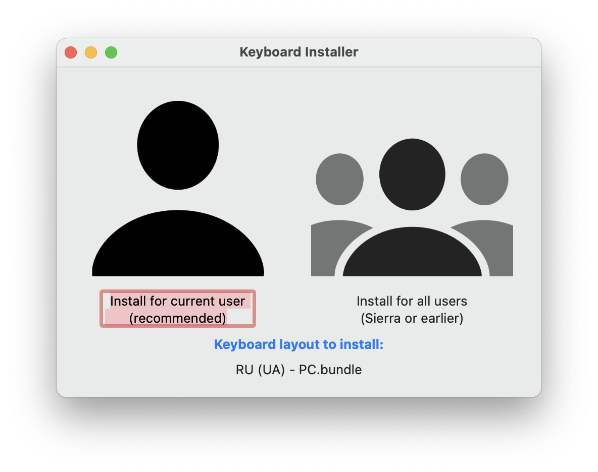

## Що це?

Апгрейд росiйськомовного лейаута `Russian - PC` для macOS на Украïнський флаг.

## Установка

Завантажте та установiть додаток [Ukelele](https://software.sil.org/ukelele/).

Потiм запустiть наданий файл `RU (UA) - PC`.

